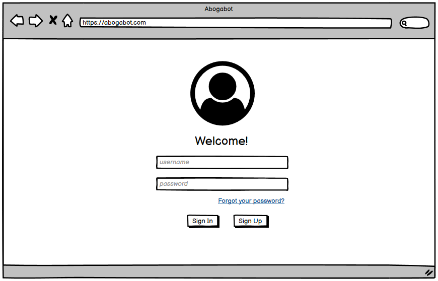
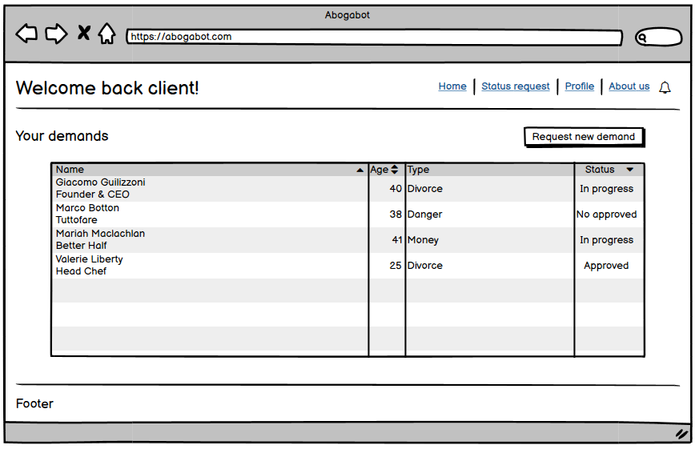
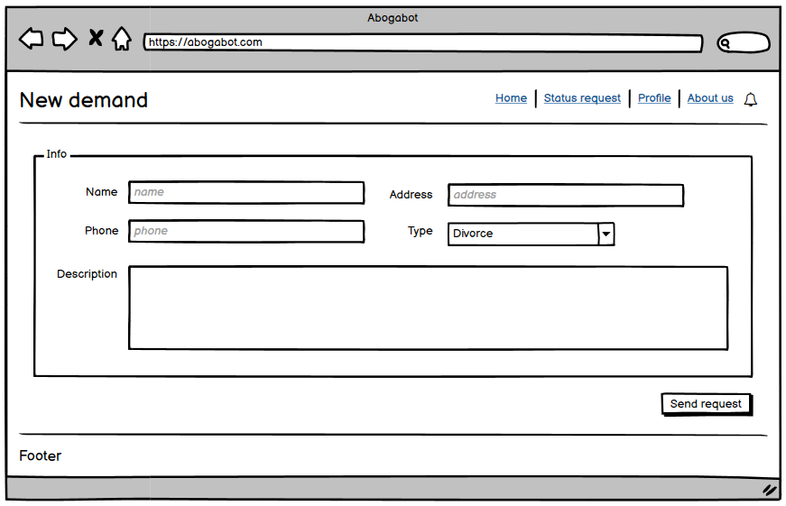
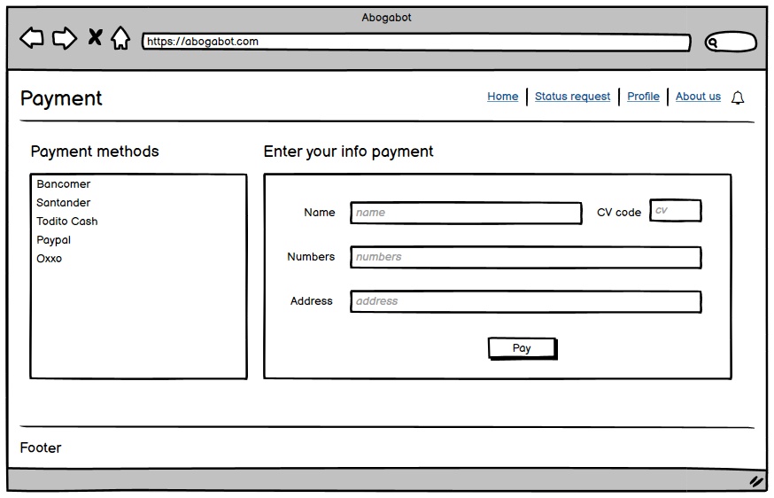
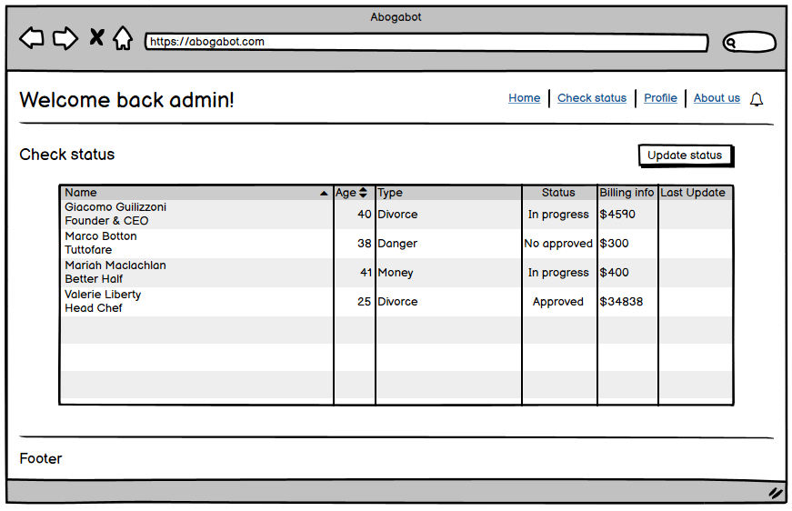
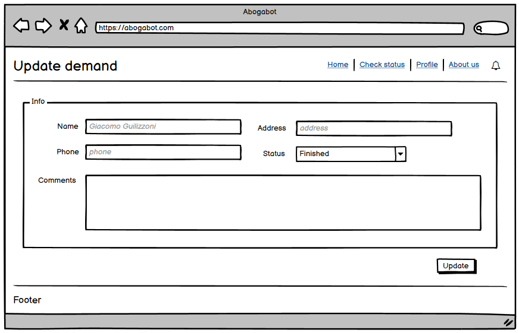

# Practice 04 - Wireframes 📚

Remember that you can [download](./practice04-wireframes.bmpr) my wireframes from Balsamic.

## Screenshots

### Login

- Login page

### Client

- Home Page.

- Form Page.

- Payment Page.

### Administrator

- Home Page.

- Update Page.

## Credits:

Credits to Juan Rodrigo Martínez Plascencia - Web developer and cibersecurity specialist.

Follow him on:

- GitHub: romarpla
- Instagram: romarpla

And Luis Enrique Mendoza Higuera - Entry-level Software Engineer.

Follow him on:

- Github: enrique-mendoza
