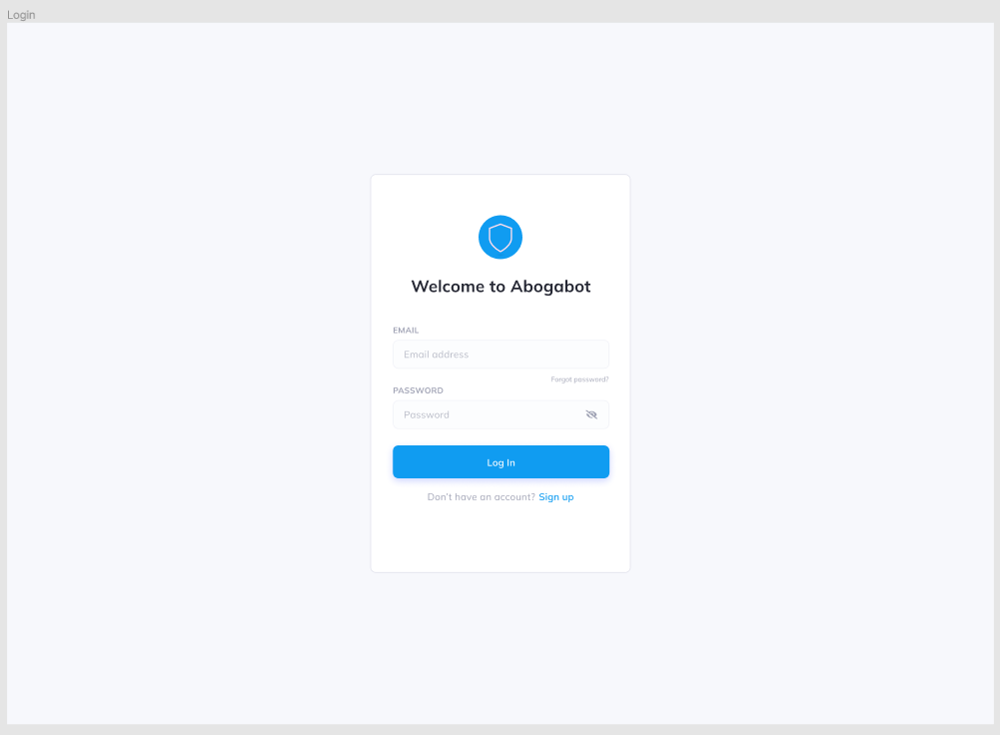
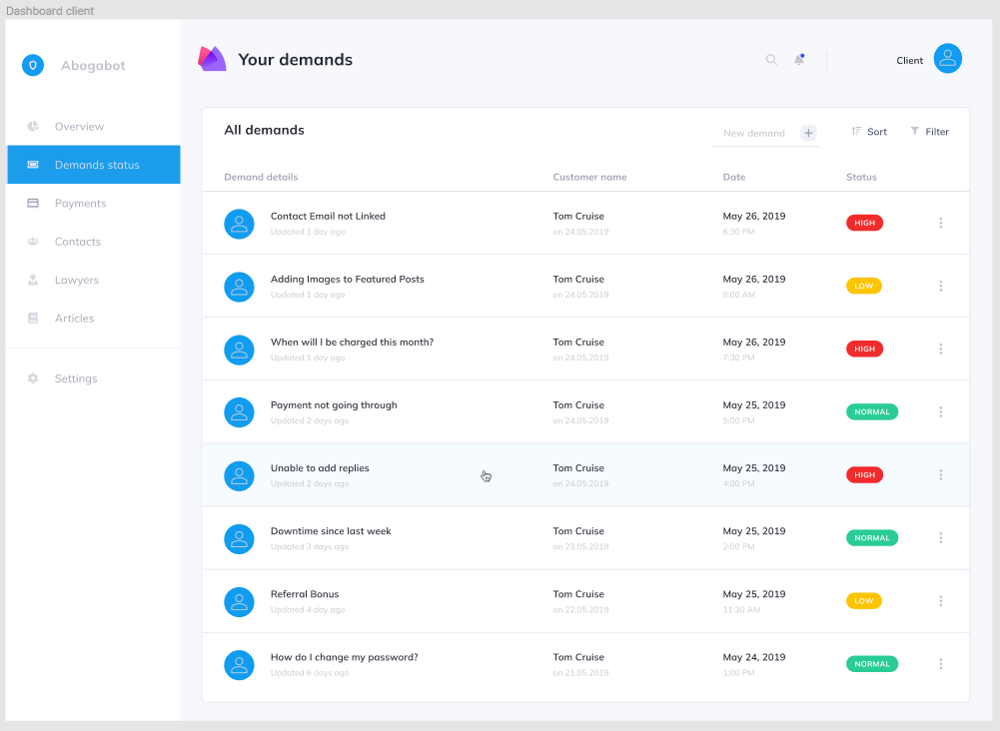
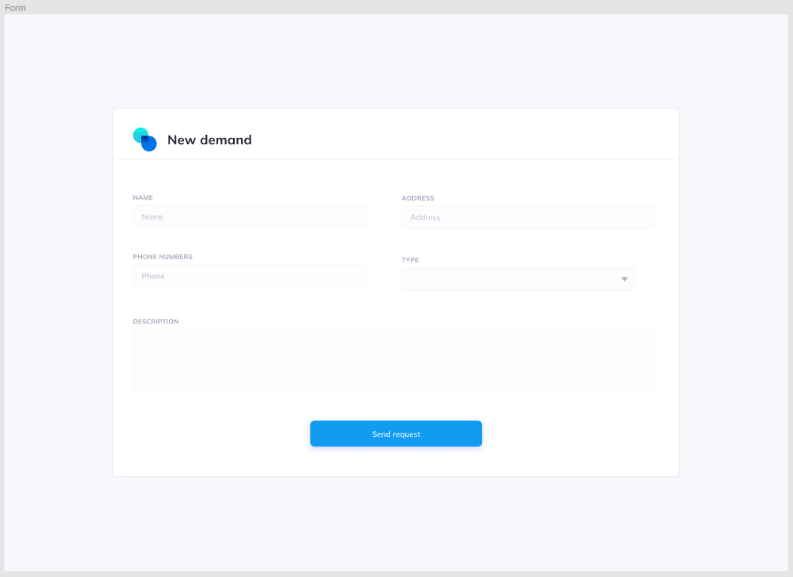
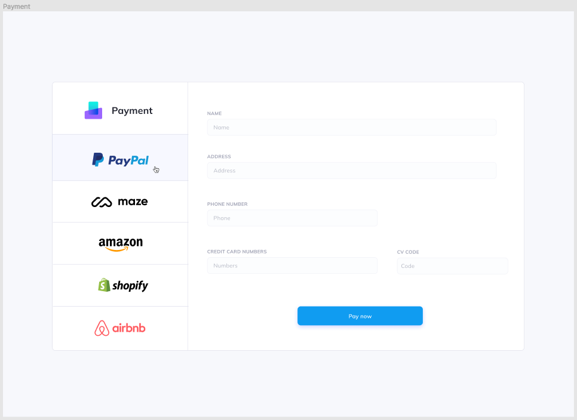
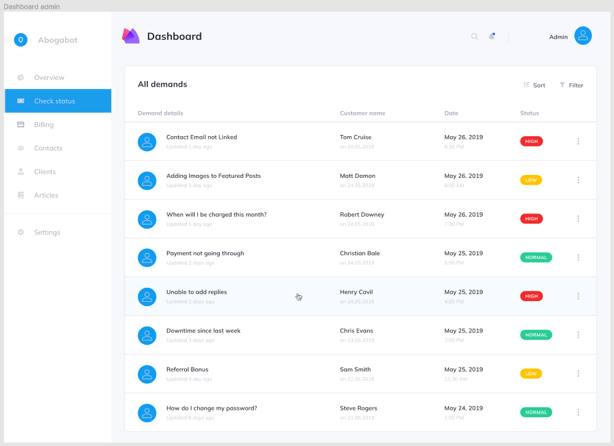

# Practice 05 - User Interface 📚

You can follow this [link](https://www.figma.com/file/etT55Fa0zdDIrJYEumg53O/Intro?node-id=0%3A1) to see my Figma project. 👀

## Screenshots

### Login

- Login page

### Client

- Home Page.

- Form Page.

- Payment Page.

### Administrator

- Home Page.

- Update Page.

## Credits:

Inspiration and template:

- [@saasdesign](https://www.figma.com/community/file/809559910249051285)

Icons:

- [@saasdesign](https://www.figma.com/community/file/809469097394620549)
- [@uitrend](https://www.figma.com/community/file/1078333497483884238)

Credits to Juan Rodrigo Martínez Plascencia - Web developer and cibersecurity specialist.

Follow him on:

- GitHub: romarpla
- Instagram: romarpla

And Luis Enrique Mendoza Higuera - Entry-level Software Engineer.

Follow him on:

- Github: enrique-mendoza
